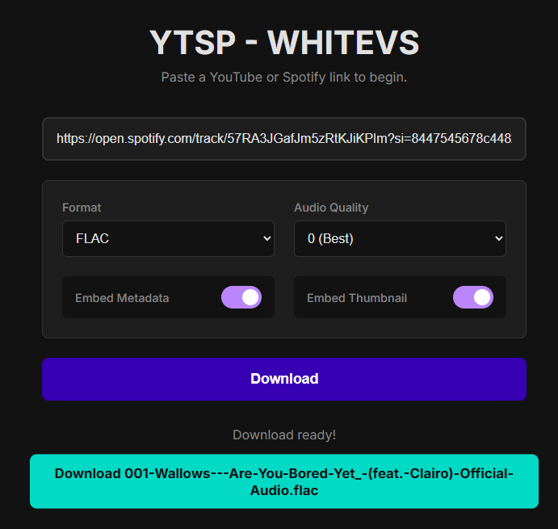
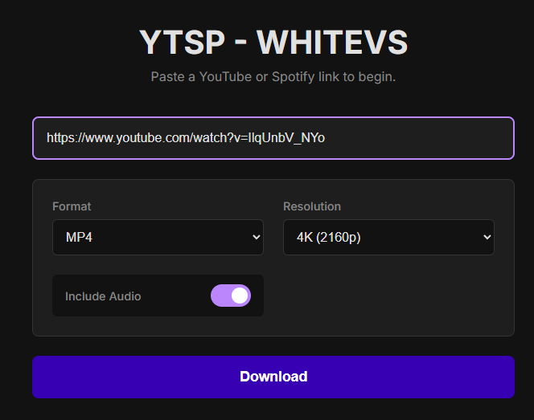

[](https://www.python.org)
[](https://www.gnu.org/software/bash/)
[](https://html.spec.whatwg.org/)
[](https://www.w3.org/TR/css/#css)
[](https://ecma-international.org/publications-and-standards/standards/ecma-262/)
[](https://github.com/whiteviews)


# YTSP
YTSP is a tool based on yt-dlp that brings a graphical interface accessible via the device's local ip.

## Features
- **Video Support**  
Lets you pick Format, Resolution and if to include audio. 
- **Audio Support**  
Lets you pick Format, Audio quality, If to Embed Metadata and If to Embed Thumbnail
- **Spotify Support**  
If a spotify link is entered, it will download the audio files from Youtube, only fetching the name of the music from spotify
- **Playlist Support**  
Playlists will be inserted in a zip
- **Search Function**  
Search up videos or songs using the toggle within the search bar (also including a settings button and search button)
- **Files Tab**  
View all the files processed by your "server", pressing the 3 dots from the wanted file brings up 2 options: Download, Delete
- **Download Button**  
This is pretty self explanatory, download button to retrieve your files after the program processes them
- **Runs on your device's local ip**  
This lets you access the site from your other devices

### Requirements
Run these commands to install the requirements:
- **Linux**

First:
```bash
sudo apt install ffmpeg python3 git
```
Second:
```bash
 pip install --upgrade flask spotipy yt-dlp  
```
- **Termux**

First:
```bash
pkg install python ffmpeg git
```
Second:
```bash
pip install --upgrade flask spotipy yt-dlp
```
### Installation  
- **Via terminal**  
```bash
git clone https://github.com/whiteviews/YTSP.git
cd YTSP
```
- **Via Release**  
Download the zip and extract it to where you want the tool to be.

### Usage
- **Step 1**  
Go to https://developer.spotify.com/dashboard , make an app, get the Client ID and Client Secret
- **Step 2**  
CD to where the app.py is located and type ```python app.py --setup```
- **Step 3**  
Enter the Client ID and CLient Secret as prompted (required to be able to fetch songs & playlists from spotify)
- **Step 4**  
Run ```python app.py``` , Your device's local ip will be shown in the terminal with the port "5000"
- **Step 5**  
To access the app, go to ```your.device's.ip:5000``` or use the port displayed in the terminal
## Screenshot (AUDIO)
  

## Screenshot (VIDEO)

